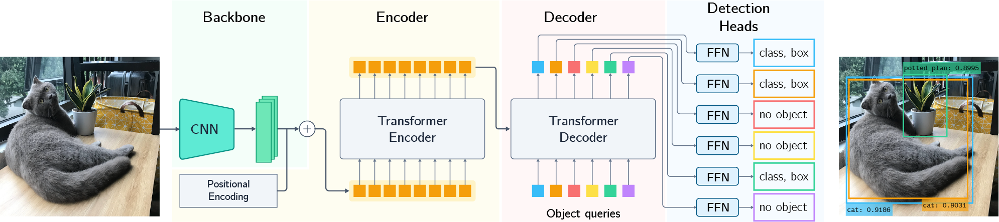
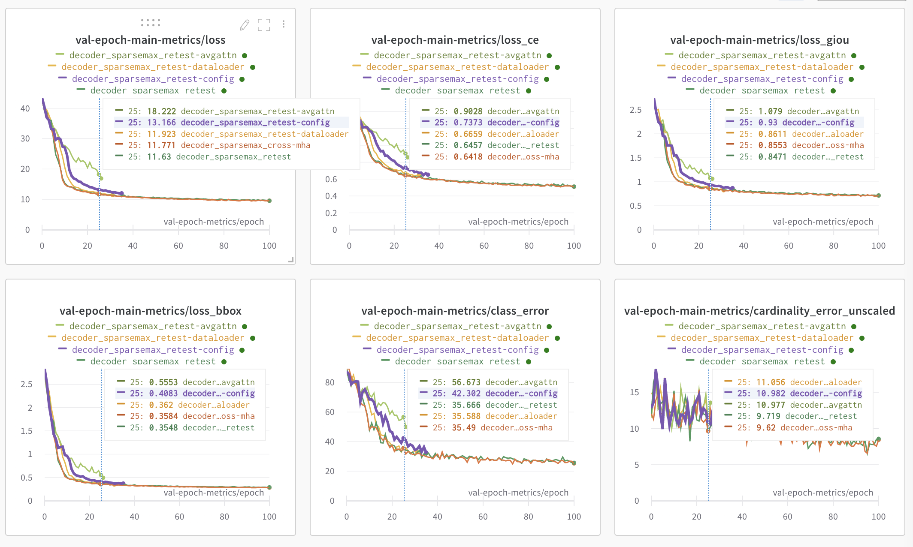
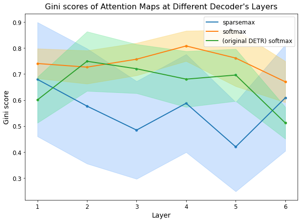
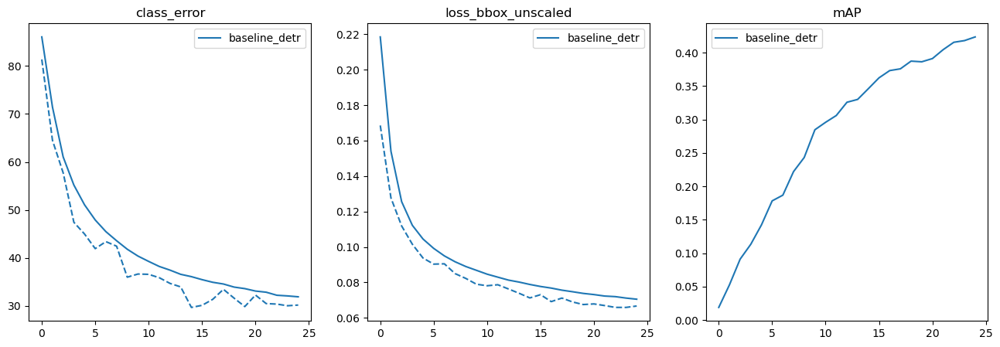
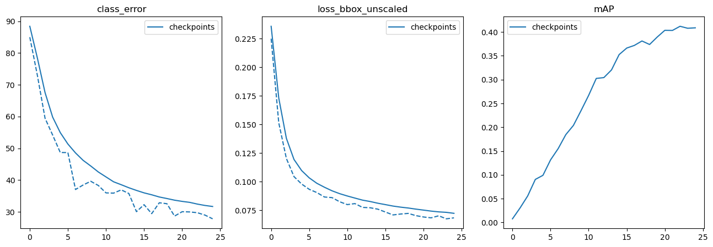

# Sparsity, Where and How? Incorporating Sparse Attentions into Transformer for Object Detection in Images

Master Thesis Project by Cuong Duc Dao -- Master's Programme in Machine Learning, KTH, Sweden.


## Work Logs

This section contains the log of the works that I have done in this project. I'm trying to log my works as details as possible to help my future self in tracing back to any problems, directions I've tried.

**TODO:**
- Check the implementation of Gini score. Usually a gini score = `1` indicates high sparsity wheareas `0` indicates low sparsity. It seems that our results are opposite.


### June 1, 2022
- After a reminder from the supervisor, we've realized a flaw in the way we're computing the metrics. Specifically, the metrics should be computed for all attention maps from all queries, not just for those whose detection's confident scores meet a certain threshold. We need to compute the metrics again for all models.

**Zero entries ratio**
```
Randomly initialized softmax
Mean: tensor([0., 0., 0., 0., 0., 0.])
Std: tensor([0., 0., 0., 0., 0., 0.])

Trained softmax (threshold=1e-6, without detection's confidence threshold)
Mean: tensor([0.7123, 0.9125, 0.8622, 0.8872, 0.7091, 0.6634])
Std: tensor([0.0420, 0.0332, 0.0278, 0.0232, 0.0276, 0.0298])

Trained softmax (threshold=1e-6, detection threshold=0.9)

Randomly Initialized Entmax15
Mean: tensor([0.7477, 0.7777, 0.7933, 0.7874, 0.7819, 0.7899])
Std: tensor([0.0699, 0.0561, 0.0510, 0.0598, 0.0563, 0.0577])

Trained Entmax15
Mean: tensor([0.9540, 0.9825, 0.9735, 0.9764, 0.9788, 0.9775])
Std: tensor([0.0189, 0.0047, 0.0067, 0.0109, 0.0056, 0.0084])

Randomly Initialized  Sparsemax
Mean: tensor([0.9608, 0.9698, 0.9675, 0.9734, 0.9686, 0.9701])
Std: tensor([0.0080, 0.0062, 0.0084, 0.0063, 0.0075, 0.0074])

Trained Sparsemax
Mean: tensor([0.9912, 0.9942, 0.9959, 0.9947, 0.9955, 0.9958])
Std: tensor([0.0024, 0.0012, 0.0009, 0.0014, 0.0010, 0.0012])
```
- We have

### May 30, 2022
- Today, we've computed the metrics for randomized models.


### May 29, 2022
- The `decoder_sparsemax_retest-config` re-experiment was max out it time on Berzelius (3 days). We've resumed it and continued training.


### May 27, 2022
- The next update for the codebase is to add a new parameter `average_cross_attn_weights` to DETR to allow whether to average the attention weights across heads or not. We're also running a sparsemax experiment to verify this change.
- In the mean time, we're computing the Gini score for those models we trained previously.
- We observed that the Gini scores now are similar to what we got previously. So we're pretty confident that the behavior of the Gini score wasn't due to any hick-ups in the code. Rather we should find a better metric.
- We've added a new metric: **zeros ratio** - the ration between the number of zero entries vs total number of entries in an attention matrix. For sparse attention matrices, it's obvious how to compute this metric. For dense (softmax) matrices, we currently use a threshold of `1e-6`
```
Sparsemax:
Mean: tensor([0.9828, 0.9878, 0.9947, 0.9930, 0.9952, 0.9930])
Std: tensor([0.0065, 0.0053, 0.0019, 0.0019, 0.0014, 0.0025])

Entmax15 (threshold = 1e-6):
Mean: tensor([0.9631, 0.9863, 0.9865, 0.9836, 0.9855, 0.9748])
Std: tensor([0.0221, 0.0060, 0.0044, 0.0079, 0.0066, 0.0115])

Entmax15 (without threshold):
Mean: tensor([0.9628, 0.9862, 0.9865, 0.9835, 0.9854, 0.9747])
Std: tensor([0.0222, 0.0061, 0.0044, 0.0080, 0.0066, 0.0115])

Softmax:
Mean: tensor([0.7106, 0.8231, 0.8755, 0.8615, 0.8727, 0.6854])
Std: tensor([0.0451, 0.0246, 0.0338, 0.0181, 0.0358, 0.0262])
```
- After a couple of hours re-running the sparsemax experiments, we've seen that there are differences in how the losses, the AP curves are exhibiting for the same experiment at different commits.

- We've also launched the baseline and entmax15 experiments again.

### May 26, 2022
- We've refactored the configurations (including model configs, trainer configs) into YAML files. There was a small hickup, the `weight_decay` hyperparam was set to `0.1` instead of `1e-4`.
- After fixing that `weight_decay` hyperparam, we've rerun another sparsemax experiment to verify if everything is working as expected. That run should be lasting for 20 - 30 epochs.
- Also, as we referred to the original DETR repo, we've realised that there were 2 hyperparams misconfigured, i.e., `lr_backbone` should be `1e-5` (instead of `1e-4`) and `lr` should have been `1e-4` (instead of `1e-5`). This might explain the weird behavior for the sparsemax experiment. We'll run it again.
- So far, as we've fixed the misconfigurations, the sparsemax experiment seems to have behaved similar to the original sparsemax experiment we did two months ago.
- Next, we'll refactor the `build_dataloaders` function and parameterise the `split` argument so it will only build one dataloader at a time. We also launch the sparsemax experiment again to test this refactor.

### May 25, 2022
- We conducted an inspection to the history of the codebase, but haven't been able to really pinpoint the changes that broke the model, training, etc.
- Thus, we decided to take the last working version, i.e., from `decoder_entmax_cross-mha` branch as the working version to work on computing the Gini scores. To this end, we created a new branch called `backup` from this branch and tagged it with `v2.0`
- We're now refactoring the config and gradually testing the refactor.
- One thing we've noticed when reviewing the DETR's github is that they seem not to use `pre_norm` and `aux_loss`.

### May 25, 2022
- We've tried different formulation of the Gini index, all seems to have pointed out that the `softmax` model attains a higher sparsity score (gini score) than the `sparsemax` model, which doesn't align with our hypothesis.
- We're now thinking of inspecting the attention maps manually for more images to have a visual observation of the attention maps from models.
```
Softmax Baseline Sparse-MHA DETR
Mean: tensor([0.7757, 0.8023, 0.8016, 0.8123, 0.8159, 0.7553])
Std: tensor([0.0557, 0.0677, 0.0655, 0.0655, 0.0741, 0.0614])

Softmax Baseline DETR
Mean: tensor([0.7797, 0.7724, 0.7797, 0.7595, 0.7507, 0.6428])
Std: tensor([0.0919, 0.0971, 0.0968, 0.0955, 0.0830, 0.0902])

Softmax Original DETR
Mean: tensor([0.7358, 0.7687, 0.7449, 0.7159, 0.7269, 0.6619])
Std: tensor([0.0974, 0.1049, 0.0961, 0.0988, 0.0968, 0.0925])

Sparsemax
Mean: tensor([0.2072, 0.1240, 0.1062, 0.1138, 0.0841, 0.1229])
Std: tensor([0.1254, 0.0599, 0.0357, 0.0389, 0.0312, 0.0602])
```

### May 24, 2022
- The problem with Gini score not making sense on the COCO validation set still remains. Today, we want to double check that we indeed took the attention maps after `softmax` or `sparsemax` function when evaluating this scores.
```
Softmax - baseline DETR
Mean: tensor([0.6134, 0.5853, 0.5936, 0.6019, 0.6878, 0.4906])
Std: tensor([0.1976, 0.2031, 0.2191, 0.2004, 0.0839, 0.0861])

Sparsemax
Mean: tensor([ 0.4067,  0.2076, -0.0333,  0.1803, -0.1638,  0.2226])
Std: tensor([0.4510, 0.4625, 0.3892, 0.3889, 0.3628, 0.4253])
```
- There is an important comment from my supervisor: **The score should be computed for each attentions of those L layers, H heads separately. Don't average the attention weights across heads and then compute the scores**
- We've added the update to implement the idea above. However, it's very slow since there are too many nested loops.

### May 20, 2022
- We've paid a more thorough investigation into the implementation of Gini score. The formular proposed by the paper and the alternative formula on Wikipedia seems to produce the same results on our test data. But on COCO val set, the results are different.
- For sparsemax model
```
Mean: tensor([ 0.4067,  0.2076, -0.0333,  0.1803, -0.1638,  0.2226])
Std: tensor([0.4510, 0.4625, 0.3892, 0.3889, 0.3628, 0.4253])
```
- For softmax model
```
Mean: tensor([0.6134, 0.5853, 0.5936, 0.6019, 0.6878, 0.4906])
Std: tensor([0.1976, 0.2031, 0.2191, 0.2004, 0.0839, 0.0861])
```

### May 19, 2022
- Today, we're checking our `gini` function. The `test_gini` script computes the gini scores (implemented in `sparse_detector.utils.metrics.gini`) for a dense and a sparse tensor. It has shown that the sparse tensor has higher gini scores, which is the expected behavior.
- We recomputed the Gini scores for three models:
  - Our DETR baseline with softmax activation which was trained for 300 epochs
  - Our sparsemax variant which was trained for 300 epochs
  - The original DETR with softmax activation which was trained for 500 epochs
- The results are a bit confusing


- A small detail we've noticed when loading the DETR model from the original checkpoint (i.e., obtained from DETR's github) is that it doesn't include pre-normalization. However, in the code, the `pre_norm` hyperparameter is default to `True`.

### May 11, 2022
- After a week of debugging `alpha-entmax`, we still haven't able to pinpoint the problem. This suggests us to take the learnable alpha out of the current context of DETR and, instead, try it on a very simple network to see if it's learn anything.

### May 8, 2022
- We still have the problem that `alpha` in entmax is not learnable in our implementation. It might just be that we need to train for much more epochs to see the difference. Also it's better to have a complete logging infra with `alpha` to really see how it's learned.
- While debugging, we've realised that if we set the `decoder_act` to `softmax` and run the training pipeline, the `CE loss` and `cardinality_error` are different than the softmax baseline experiment we had previously. This is suspicious and calls for a thorough investigation.

### April 30, 2022
- While waiting for better solution with debugging `alpha`, we'll run some hyparam search for sparsemax. Starting with queries = 256 (instead of 100)
- It turned out that the number of queries isn't something that we can randomly tune and get better results. It's recommended to keep it as `100`

### April 28, 2022
- We're debugging the issue of `alpha` is not learned for `SparseMultiheadAttention`
- After spending the whole afternoon debugging, we seem to have been able to make `alpha` learnt. The next thing is to add `alpha` (of different heads, at different layers) to W&B log so we could have a more visible way of visualization how alpha is learned during the training.

### April 27, 2022
- We're taking a look at the `entmax` with learnable alpha, and the `tvmax` implementation to see what should be done first, in terms of, what could get done easier.
- After 2 hours, we've ended up with the first version of `alpha-entmax` for the MHSA. Currently, the logging doesn't log the value of `alpha` while training, and we don't have a full picture on the `alpha` of different heads in each decoder's layer yet. That's the next step. To this end, we currently need to figure out the proper dimensionality of `alpha`.
- A question arised is "how to get the attentions of a particular head from a specific layer?" -> That can be done by disabling `average_attn_weights` in the `forward` function of the MHSA class.
- Meanwhile, we've got some updates on the `entmax15` experiment:
```
It seems to be a bit better than the sparsemax model (all the hyperameters are the same between two experiments). Most performance metrics of entmax15 are about 0.4 - 0.5 points better. After 250 epochs, the AP-Small of entmax15 is 1 point better than sparsemax is closing to the baseline. This might suggest that a softer sparsity might be desirable.
```

### April 26, 2022
- We continue to work on the Gini score.
- However, as we create different files, scripts in our project, we feel the growing need to being able to load default model configs from files, and create a model instance from those configs. Thus, we spent some times on this technical debt first.
- Hooray! We've got some first Gini scores of the sparsemax model
```
|-------------|----------------|----------------|----------------|----------------|----------------|----------------|
| model       | layer 0        | layer 1        | layer 2        | layer 3        | layer 4        | layer 5        |
|-------------|----------------|----------------|----------------|----------------|----------------|----------------|
| sparsemax   |0.6796 - 0.2199 |0.5765 - 0.2219 |0.4841 - 0.1883 |0.5874 - 0.1888 |0.4196 - 0.1720 |0.6084 - 0.2047 |
|-------------|----------------|----------------|----------------|----------------|----------------|----------------|
| softmax     |0.7407 - 0.0575 |0.7267 - 0.0640 |0.7572 - 0.0626 |0.8083 - 0.0584 |0.7616 - 0.1087 |0.6702 - 0.0794 |
|-------------|----------------|----------------|----------------|----------------|----------------|----------------|
```

### April 24, 2022
- After too much pause, we've restarted the work on this thesis project.
- We'll try a new activation function `entmax15`, just to see if a *softer* level of sparsity would result in something different.
- Next,we'll compute the gini index for attention maps in each layers of the model. For a given input image, for each layer, the gini is average across all the queries. We then can report the gini scores for all layers of a model on the validation set.

### April 15, 2022
- Today, we've added more visualization of intermediate layers from the decoder.

### April 12, 2022
- Today, we're going to inspect some more samples with the `sparsemax` model to see if it always attends to the corner of the input images.Through two examples we've looked at, it seems that when there is only a prominent object in the image, `sparsemax` model doesn't really spread its attention to corners. However, there are attentions outside of the bounding boxes of the object.

### April 11, 2022
- We now add groundtruth boxes to the visualizations of attention maps and detection results.

### April 8, 2022
- After several days not working on the thesis, we're now restarting the work. First off, some changes need to be made to the figures.
- Then, we'll add more visualizations: drawing bounding boxes, showing groundtruth boxes on both the images and the attention maps.

### April 4, 2022
- Finally, after a couple of days ``resting'' in Vietnam, I've returned to my thesis work.
- The problem we're dealing with, at the moment, is the mismatch in tenson dimension between the attention matrix from transformer blocks vs the ones expected by `TVMax`.
- The original TVMax repo is not very well-documented and it's hard to even run the code. We'll need to dig deeper and figure out the proper dimension. Probably need to read the paper more carefully as well.

### March 30, 2022
- I'm at Arlanda waiting for my flight to Frankfurt, Singapore then Hanoi
- We're working on the implementation of TVMax. There is an [existing implementation](https://github.com/deep-spin/TVmax) that we'll try first.
- Seem that the default implementation of `TV2DFunction` cannot be directly plugged into our pipeline due to the mismatch of input shapes. Need to look into this problem.
- The default implementation of `TVMax` doesn't seem to operate on batched tensor. So a hack we're currently doing is to iteratively apply the `tvmax` function over all slices of the tensor. However, it makes the training hang after calling the function for 5, 6 times. The GPU consumption is just around `8GB/40GB`. We're investigating this problem.

### March 28, 2022
- The baseline training has stopped due to the excessive time on Berzelius. We'll restart it.
- The sparsemax version training follows the trends of the baseline, with lower performance. This is expected. We'll need to think about which kind of parameter tuning we can/should do. Also, we'll look more closely into the attention maps.

### March 26, 2022
- We're on a cruise trip to Helsinki 😍🛳.
- The run to verify if the replacement of `nn.MultiheadAttention` by the `SparseMultiheadAttention` works or not seems to confirm that it works. The losses and other metrics in both cases have close values and similar trend.
- Next, we're going to conduct the first experiment with `sparsemax` as the activation function in the multi-head cross attention. To this end, we'll use the same settings as the baseline.
 
### March 25, 2022
- We continue to test the custom `MultiheadAttention`.
- We've add a `decoder_mha` parameter to the Transformer class allowing to specify which type of attention layer the model is going to use. By default, it's the `nn.MultiheadAttention`. We've also completed implementing the `SparseMultiheadAttention` which supports sparse activation function `sparsemax`. The implementation is similar (and *simplified*) to Pytorch's implementation.
- A quick test with the `visualize_attentions` script, the forward pass of the whole model with the new custom MHA layer is successful.
- We'll run the `baseline_detr` training for 25 epochs to test if the new implementation (by default with softmax) is working properly.

### March 24, 2022
- After a discussion with our supervisor, we believe the best way to incorporate `sparsemax` into the current codebase is to create a custom MHA module that use sparse max. This custom MHA should then be used in the place of the current `self.multihead_attn` of the `TransformerDecoderLayer`.
- After we have had the first version of a custom MHA, the challenge is to unittest it to make sure that everything at least runs with properly-shaped inputs. However, we aren't not sure of the shape of queries, keys, values, etc. Thus, we need to do a surgery of the model during the forward pass.

### March 15, 2022
- The baseline training was crashed after 17 epochs. The cause was that we switched the branch of the codebase leading to wrong data path. It has been resumed successfully.
- We ran the original DETR training for 25 epochs, and our **refactored** codebase for 25 epochs. Both for the Baseline experiment. We then plot the `class_error, loss_bbox_unscaled, mAP` for both cases. Our results are very similar to the original results. Therefore, we can be relieved that the refactoring did not change the expected behaviors of DETR.

Our implementation

DETR origianl implementation
- Some other things to do: include mAP plots on W&B, explore evaluation results, create visualizations.


### March 14, 2022
- It turned out that refactoring took more time than expected. The job now is to integrate W&B logging. The quick way to do so is to integrate logging right into the current `MetricLogger` class, which seems to be messy.
- Logging to W&B is working, but we need to handle the **global_step** problem. Currently, its value is not correct.
- After digging for about 3 hours, W&B logging is working as expected. There is still one problem, though. There are two many metrics logged, most of them are explaination of some major metrics. For more readability of visualizations and loggings, it is good to display on WandB metrics grouped as follow:
  - `train-main-metrics`: major metrics including `loss, loss_ce, loss_bbox, loss_giou, class_error, cardinality_error`. All should be scaled.
  - `train-metrics`: all variants of those in the main metrics section.
  - `train-extra-metrics`: metrics including `memory, iter_time, data_time`
  - `train-epoch-main-metrics`: major metrics as in `train-main-metrics` but for epoch
  - `val-epoch-metrics`: metrics for validations
- Keeping a global variable named `global_step` is much easier for experiment tracking

### March 12, 2022
- We continue to work on refactoring the `train_baseline` pipeline. Our major concerns at the moment include 1) how to manage the configurations of different experiments more efficiently; and 2) if there is any better alternative to the architecture of the codebase.
- The goal for today is two-fold:
  - Finish refactoring the code so we could start running the baseline experiment
  - Integrate W&B logging -- **This is a must**

### March 10, 2022
- Refactoring the DETR codebase to a more modular structure is pretty straightforward. All the parts related to segmentation have been removed.
- It seems that the refactoring works so far, i.e., results before and after refactoring are similar. Next, we're going to modularize the configurations.
- TODO: Figure out how to run the current code structure with `torchrun`

### March 9, 2022
- After consideration, we decided that we will not be porting the code to Pytorch Lightning. Instead, we will base on the original DETR repo and gradually add the features/functionalities we need to the repo.
- First off, we'll move it to a more modular structure, and clean up the segmentation parts as we're not doing segmentation in this project.

### March 5, 2022
- At this time of writing, the repository is hosted on Berzelius where the computational resources are abundant. However, we might need to soon move it to the RPL cluster in which only GPUs up to 12GB VRAM are available. Therefore, we might need to experiment with a smaller backbone (such as `resnet18` or `resnet34`) so that the whole DETR would fit into the GPUs.
- First off, we're exploring the [ResNet pretrained model](https://pytorch.org/hub/pytorch_vision_resnet/) provided by `torchvision`.
- We're still considering if we should move the DETR codebase to pytorch lightning.
   - Pros: remove many boilerplates, making debugging easier, handle distributed training on multiple GPUs
   - Cons: potential performance decrease, some special cases (even though we're not aware of any yet) might be difficult to implement in PL.
- Try to train DETR on COCO 2017 on 6 GPUs, hyperparameters are identical to the original DETR repo, except `batch_size = 8, num_workers = 4`. On average, an epoch takes `15` mins, which is twice faster than the original DETR trained on 8 V100s.
- **NOTE:** A potential can of worms is DETR's original implementation of transformer is mostly based on Pytorch's transformer, which is deeply nested with other pytorch's layers and functions. As a result, chaning self-attention mechanism by replacing `softmax` with other alternatives such as `sparsemax` wouldn't be straightforward.
- After checking the CNN-backbone part, it seems to be fairly straightforward.
- Next, we're looking into the COCO dataset loader.
